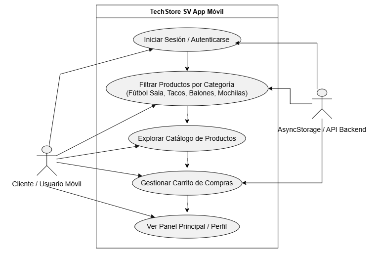

# Diagrama de Casos de Uso - App Móvil
## 1. Representación Visual

## 2. Descripción de Actores y Flujos
* **Usuario de la App:** Puede registrarse, iniciar sesión y realizar operaciones dentro de la
interfaz móvil.
* **Sistema Backend / API:** Recibe las peticiones HTTP/JSON desde la app móvil y valida los
datos en la base de datos.