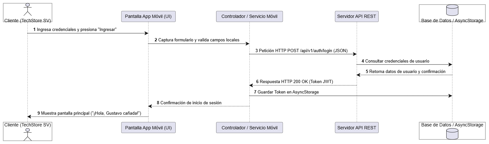

# Diagrama de Secuencia - Flujo Principal
## 1. Diagrama de Interacción

## 2. Explicación del Flujo
1. El usuario ingresa sus credenciales en la interfaz de la aplicación móvil y presiona "Ingresar".
2. La app móvil genera una petición `POST` enviando los datos en formato JSON hacia la API
REST.
3. La API procesa la solicitud, consulta la Base de Datos y devuelve una respuesta con un Token
de sesión.